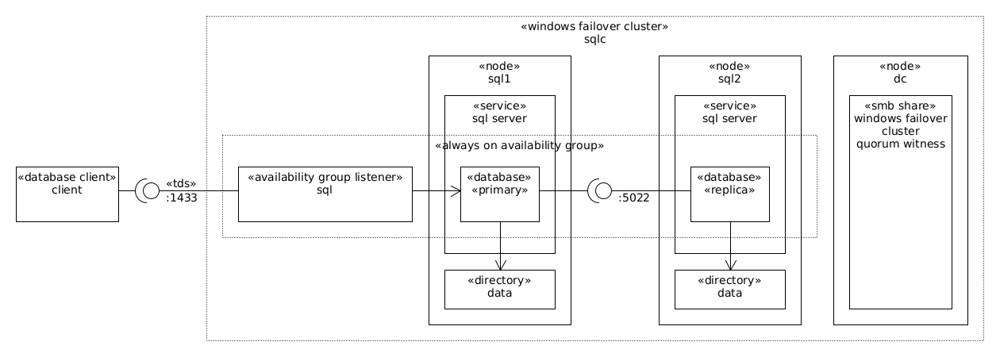

# About

This is an example Vagrant environment for a SQL Server Cluster installation.

This deploys a [Always On Availability Groups (AG)](https://learn.microsoft.com/en-us/sql/database-engine/availability-groups/windows/overview-of-always-on-availability-groups-sql-server?view=sql-server-ver16) SQL Server Cluster.

The major components are:



This environment scripts will:

* Create the `DC` Windows Domain Controller (DC).
  * Host the `example.test` domain Active Directory (AD) site.
  * Host the `fc-storage-SQL-CLUSTER` SMB File Share for the `SQL-CLUSTER` Windows Server Failover Cluster (WSFC) quorum storage.
  * Host the SQL Server Management Studio application.
  * Create the `SQL Server Administrators` AD group.
    * Add the `vagrant` account as member.
* Create the `SQL-CLUSTER` Windows Server Failover Cluster (WSFC).
* Create the `SQL` SQL Server Always On Availability Group cluster between the `SQL1` and `SQL2` nodes.
  * Grant the `SQL Server Administrators` AD group the SQL Server `sysdamin` role.
* Change the SQL Server Settings.
  * Mixed mode authentication.
  * Allow TCP/IP connections.
  * Allow encrypted connections (using a private CA).
* Create Users.
  * SQL Server Users: `alice.doe` (in the `sysadmin` role), `bob.doe`, `carol.doe`, `dave.doe`, and `eve.doe`.
  * Domain Windows Users: `john.doe` (in the `Domain Admins` group), and `jane.doe` (in the `SQL Server Administrators` group, which infers the `sysadmin` role).
  * All have the `HeyH0Password` password.
* Create the `TheSimpsons` Database.
  * Create the `db_executor` database role with permissions to execute stored procedures.
  * Add users to database roles.
    * `carol.doe` in the `db_datawriter`, `db_datareader` and `db_executor` roles.
    * `eve.doe` in the `db_datareader` and `db_executor` roles.
* Show how to run the PowerShell, Python, Java, C# and Go [examples](examples/).


# Usage

Install the [Windows 2022 UEFI base box](https://github.com/rgl/windows-vagrant).

Launch the environment with:

```bash
vagrant up --no-destroy-on-error
```

Login into the `DC` node as the `vagrant` domain user.

Open a PowerShell session.

Build and execute the examples:

```pwsh
pwsh.exe -File c:\vagrant\ps.ps1 examples\run.ps1
```

Query the `TheSimpsons` Database:

```pwsh
Import-Module SqlServer

Invoke-Sqlcmd `
  -ServerInstance sql.example.test `
  -Database TheSimpsons `
  -Username eve.doe `
  -Password HeyH0Password `
  -Query "select Name from Character where Name like '% Simpson' order by Name"
```

Open a Bash/ConEmu session, and dump the SQL Server TLS details:

```bash
# see the TLS certificate validation result:
echo | openssl s_client -connect sql.example.test:1433 -servername sql.example.test -CAfile /c/vagrant/tmp/ca/example-ca-crt.pem
# see the TLS certificate being returned by the server:
echo | openssl s_client -connect sql.example.test:1433 -servername sql.example.test -CAfile /c/vagrant/tmp/ca/example-ca-crt.pem | openssl x509 -noout -text
```

Execute the [example queries](#example-queries).


# Reference

* [TDS 8.0 and TLS 1.3 support](https://learn.microsoft.com/en-us/sql/relational-databases/security/networking/tds-8-and-tls-1-3?view=sql-server-ver16)


# Example queries

To execute these example queries, login into the `DC` machine as the `vagrant` domain user.

Open SQL Server Management Studio.

Connect to the `SQL\SQLSERVER` SQL Server.

Execute the following example queries.

## Always On Availability Groups status

Show the current Always On Availability Group Primary and Replica servers:

```sql
select
  ars.role_desc,
  ar.replica_server_name
from
  sys.dm_hadr_availability_replica_states as ars
  inner join sys.availability_replicas as ar
    on ars.replica_id = ar.replica_id
order by
  ars.role_desc,
  ar.replica_server_name
```

Show the current Always On Availability Groups replication status:

```sql
select
  ag.name as [ag_name],
  ar.replica_server_name,
  db_name(ds.database_id) as [database],
  ds.synchronization_state_desc,
  ds.synchronization_health_desc
from
  sys.dm_hadr_database_replica_states as ds
  inner join sys.availability_replicas as ar
    on ds.replica_id = ar.replica_id
  inner join sys.availability_groups as ag
    on ar.group_id = ag.group_id;
```

Show the current Always On Availability Groups endpoints permissions:

```sql
select 
  e.name as endpoint_name,
  p.permission_name,
  p.state_desc,
  prin.name as grantee_name
from
  sys.server_permissions as p
  join sys.server_principals as prin
    on p.grantee_principal_id = prin.principal_id
  join sys.endpoints as e 
    on p.major_id = e.endpoint_id;
```

## List active connections

List active connections details:

```sql
select
  c.client_net_address,
  s.login_name,
  db_name(s.database_id) as database_name,
  s.program_name,
  c.encrypt_option,
  c.connect_time
from
  sys.dm_exec_connections as c
  inner join sys.dm_exec_sessions as s
    on c.session_id = s.session_id
order by
  c.client_net_address,
  s.login_name,
  s.program_name
```

**NB** you can customize what appears on `s.program_name` by setting the `Application Name`
connection string property, e.g., `Application Name=Example Application;`.

## List server principals

**NB** The `server principals` include the `logins`.

```sql
select
  type_desc,
  name,
  sid
from
  sys.server_principals
where
  type_desc in (
    'SQL_LOGIN',
    'WINDOWS_GROUP',
    'WINDOWS_LOGIN')
order by
  type_desc,
  name
```

## List database principals permissions

```sql
select
  principals.principal_id,
  principals.name,
  principals.type_desc,
  principals.authentication_type_desc,
  permissions.state_desc,
  permissions.permission_name
from
  sys.database_principals as principals
  inner join sys.database_permissions as permissions
    on principals.principal_id = permissions.grantee_principal_id
order by
  principals.name,
  principals.type_desc,
  principals.authentication_type_desc,
  permissions.state_desc,
  permissions.permission_name
```

## List database schema tables row count

```sql
select
  schema_name(schema_id) as schema_name,
  t.name as table_name,
  sum(p.rows) as row_count
from
  sys.tables as t
  inner join sys.partitions as p
    on t.object_id = p.object_id
    and p.index_id in (0, 1)
group by
  schema_name(schema_id),
  t.name
```

## List database row count and storage usage

```sql
select
  sum(p.rows) as row_count,
  (select sum(case when type = 1 then size end) * cast(8 * 1024 as bigint) from sys.master_files where database_id = db_id()) as data_size_bytes,
  (select sum(case when type = 0 then size end) * cast(8 * 1024 as bigint) from sys.master_files where database_id = db_id()) as log_size_bytes
from
  sys.tables as t
  inner join sys.partitions as p
    on t.object_id = p.object_id
    and p.index_id in (0, 1)
```

## List databases storage usage

```sql
select
  db_name(database_id) as database_name,
  sum(case when type = 1 then size end) * cast(8 * 1024 as bigint) as data_size_bytes,
  sum(case when type = 0 then size end) * cast(8 * 1024 as bigint) as log_size_bytes
from
  sys.master_files
group by
  database_id
```
